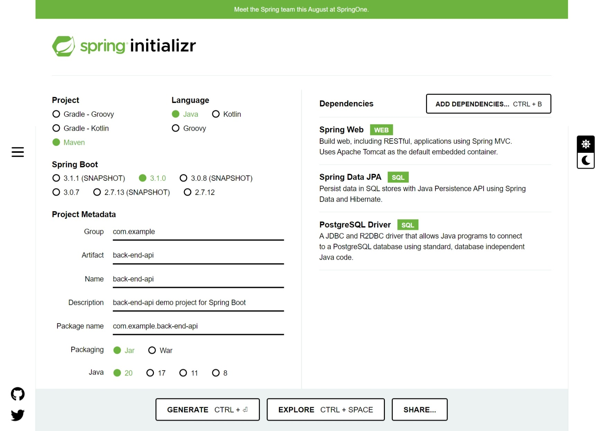

# Back-End Api Project

This is my first project with Spring Boot, and I explore the fundamentals by building a simple back-end API.

This project however does not have a front-end section.

I follow [Amigos Code](https://www.youtube.com/@amigoscode) tutorial on basics of Spring Boot, which can be accessed [Here](https://www.youtube.com/watch?v=9SGDpanrc8U)

## Project overview
---
The project is broken down into the following sections:
1. API layer : Contains GET, POST, PUT, DELETE 
2. Servie layer : For business and logic.
3. Data Access Layer : To connect to a db service

## Spring boot initializer
---
This is where we bootstrap any sping boot application. Access the site [here](https://start.spring.io/)

We make the initial setup of the project as shown below


Here are the details:
- Project builder : Maven
- Language : Java
- Spring Boot version : 3.1.0
- Packaging : Jar
- Java version : 20 (which I have installed)
- Dependenciew : 
- - Sprig web
- - Spring data JPA
- - PostgreSQL Driver

## Project notes
---

### **Restful endpoints**
Serving methods as a restful endpoint you have to use `@GetMapping` , 

The `@RestController` annotation makes classes serve rest endpoints.

the below did not work for me:
```java
@GetMapping
```

I used this instead:
```java
@GetMapping("/")
```

## **LocalDate**
What is localdate?
what is a null constructor?

## **note**
alt + insert opens uo constructors, getters, setters section